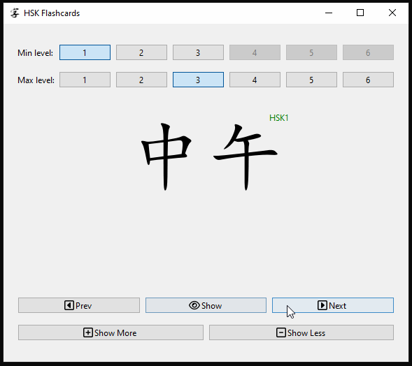

# HSK Flashcards

Flashcard app to practice Chinese words and phrases based on the (old) HSK 2.0 curriculum.



* Practice character recognition in the selected level range.
* Click `Show` to display the pinyin and translations to English.
* You can always go back to a previous character!
* Use `Show More` and `Show Less` to adjust how often a character will be shown in the future.
* Keyboard shortcuts available! Hover over a button to display the shortcut.

## How to Run

### Installation

You will need to have a running Python3 installation with [uv](https://github.com/astral-sh/uv). Then, open a terminal in the repo folder and run:

```sh
uv sync # Installs the dependencies
```

Your computer needs to have Chinese fonts installed for the character display to work, so make sure you install language support for `Chinese (Simplified)` (steps to do this are OS-dependant).

### Running

Whenever you want to start the app, open a terminal in the repo folder and run:

```sh
uv run scripts/app.py # Runs the app
```

## Technical Details

### Data Sources

* `data/complete.json` file is MIT-licensed and available at [this GitHub repo](https://github.com/drkameleon/complete-hsk-vocabulary).
    * `data/hsk-manual.csv` derived from `data/complete.json` and cleaned by hand, using my own notes to enhance it. **Currently clean up to HSK2, close to completing HSK3.**
* `data/*.svg` icons are originals from [Font Awesome](https://fontawesome.com).
    * `data/*.png` icons are derived from the corresponding SVG file.

### General Comments

The app was created in Python 3.12 using [uv](https://github.com/astral-sh/uv) as a package manager. It uses [PySide6](https://pypi.org/project/PySide6/) to interface with the Qt library, so the UI should run pretty much anywhere (tested on Windows 10 and Ubuntu 24.04).

Currently, the program tries to set a system font that exists in Windows computers if you have Chinese language support installed. It doesn't look as good in Ubuntu, but it renders (probably defaulting to a different style of font).

While the character database was processed automatically from existing sources, it is cleaned by hand. This is an ongoing project as I learn Chinese. Currently, levels 1 and 2 are considered 100% complete; level 3 is close to complete.
